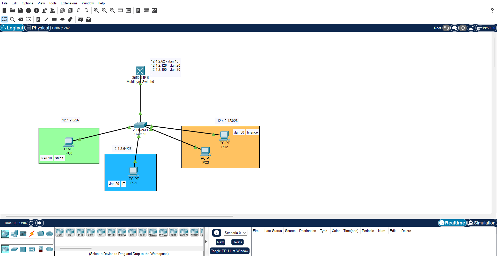

# NOC Incident Triage & Network Design Lab

Hands-on network engineering labs built to simulate real Tier 1 NOC scenarios — VLAN segmentation, inter-VLAN routing, DHCP, ACL-based security, redundancy (STP), dynamic routing (OSPF), NAT, and proactive monitoring (Zabbix). Each lab includes deliberately injected faults, diagnosed and documented using real incident ticket format.

Built in Cisco Packet Tracer.

## Why This Repo Exists

Networking theory is easy to claim on a resume — this repo is the proof. Every fault below was actually broken, actually diagnosed using CLI tools and packet-level traffic analysis, and actually fixed, with the full diagnostic trail documented the way a real NOC ticket would be written.

## Skills Demonstrated

- VLAN design and segmentation
- Inter-VLAN routing (SVI on a Layer 3 switch)
- DHCP configuration (per-VLAN scoping, exclusions)
- ACL-based traffic filtering (extended ACLs, wildcard masking)
- Trunk configuration and troubleshooting (802.1Q)
- Packet-level traffic analysis (Packet Tracer Simulation Mode)
- Incident documentation and root cause analysis (RCA)

---

## Lab 1: Small Office Network — VLANs, Inter-VLAN Routing, DHCP, ACL Security

### Scenario
A small office with 3 departments — Sales, IT, and Finance — each requiring its own VLAN and subnet, automatic IP addressing, and traffic isolation between Sales and Finance (with IT able to reach both).

### Topology
- 1 Layer 3 (multilayer) switch — SVI-based inter-VLAN routing
- 1 Layer 2 access switch
- 3 VLANs, each on a /26 subnet carved out of 12.4.2.0/24:

| VLAN | Department | Subnet | Usable Range | Gateway (SVI) |
|---|---|---|---|---|
| 10 | Sales | 12.4.2.0/26 | .1 – .62 | 12.4.2.62 |
| 20 | IT | 12.4.2.64/26 | .65 – .126 | 12.4.2.126 |
| 30 | Finance | 12.4.2.128/26 | .129 – .190 | 12.4.2.190 |



### Design Decisions
**SVI over router-on-a-stick:** chosen because a Layer 3 switch was available. SVI routes in hardware, avoids funneling all inter-VLAN traffic through a single physical link, and is simpler to manage than sub-interface encapsulation.

**Gateway addressing:** each VLAN's gateway uses a non-default address within its /26 block rather than the more conventional first address (e.g. 12.4.2.1). Not a deliberate design pattern — just how the lab was built — but worth noting that `.1` is the standard convention I'd default to in a production environment.

### Configuration Verification
| Evidence | Screenshot |
|---|---|
| All 3 SVIs up/up with correct IPs | `show ip int br` → [svi-status.png](screenshots/svi-status.png) |
| Trunk carrying all 3 VLANs | `show int trunk` → [trunk-allowed-vlans.png](screenshots/trunk-allowed-vlans.png) |
| Access ports correctly mapped to VLANs | `show vlan br` → [vlan-port-assignment.png](screenshots/vlan-port-assignment.png) |
| DHCP assigning correct subnet/gateway per VLAN | `ipconfig` on PC0 → [dhcp-verification.png](screenshots/dhcp-verification.png) |
| ACL actively blocking Sales↔Finance | ping test + `show access-lists` → [ping-tests.png](screenshots/ping-tests.png), [acl-config.png](screenshots/acl-config.png) |

### Configuration Summary
- Trunk link configured between access switch and multilayer switch, allowing VLANs 10, 20, 30
- SVIs configured per VLAN with `ip routing` enabled globally
- DHCP: one pool per VLAN on the L3 switch, gateway IPs excluded from each pool
- Extended ACL `block-sales-finance` applied outbound on the Sales and Finance VLAN interfaces, blocking Sales↔Finance while permitting all other traffic (including IT↔both)

### Faults Found & Fixed

#### Incident INC-001: Trunk Misconfiguration Isolating Sales VLAN
| Field | Detail |
|---|---|
| Severity | Sev2 — degraded, single VLAN isolated |
| Symptoms | Sales VLAN unable to reach gateway (12.4.2.62) or any other VLAN |
| Diagnostic Steps | `show ip interface brief` confirmed SVI up/up → `show interfaces trunk` revealed VLAN 10 missing from allowed list on multilayer switch trunk port |
| Root Cause | Trunk configured with `switchport trunk allowed vlan 20,30` — VLAN 10 omitted |
| Resolution | Corrected to `switchport trunk allowed vlan 10,20,30` on both ends of the trunk; verified via ping |
| Prevention | Standardize a trunk provisioning checklist listing all active VLANs explicitly at setup time |

Full ticket: [tickets/INC-001.md](tickets/INC-001.md)

#### Incident INC-002: ACL Wildcard Mask Error Allowing Blocked Traffic
| Field | Detail |
|---|---|
| Severity | Sev2 — security/compliance exposure, Sales and Finance VLANs able to communicate despite ACL segmentation policy |
| Symptoms | Ping tests between Sales (12.4.2.0/26) and Finance (12.4.2.128/26) unexpectedly succeeded |
| Diagnostic Steps | `show access-lists` showed match counts hitting `permit any any` instead of the deny lines → reviewed wildcard mask, found `0.0.0.64` instead of the correct `0.0.0.63` for a /26 subnet |
| Root Cause | Incorrect wildcard mask only covered 2 addresses instead of the full 64-address /26 range, allowing most traffic to fall through to the permit line |
| Resolution | Rebuilt ACL with corrected wildcard mask (`0.0.0.63`); verified fix via `show access-lists`, now showing 8 and 4 matches on the two deny lines respectively, with only 3 unrelated matches on permit |
| Prevention | Use the standard wildcard calculation (255 − subnet mask octet) for any non-/24 subnet; verify ACL match counters after initial deployment, not just config syntax |

Full ticket: [tickets/INC-002.md](tickets/INC-002.md)

### Verification Checklist
- [x] Each PC receives correct IP via DHCP for its VLAN
- [x] PCs within same VLAN can ping each other
- [x] IT can ping Sales and Finance
- [x] Sales cannot ping Finance (and vice versa) — confirmed via `Destination host unreachable` from ACL enforcement
- [x] Both faults diagnosed, fixed, and verified with match-count evidence

---

## Lab 2: Redundant Network — STP, OSPF, Failover *(in progress)*

## Lab 3: Multi-Site WAN — NAT, ACLs, Zabbix Monitoring *(planned)*

## Lab 4: Full Incident Response Simulation *(planned)*

---

## Tools Used
- Cisco Packet Tracer
- Zabbix *(Lab 3+)*

## Repo Structure
```
/screenshots
  topology.png
  svi-status.png
  trunk-allowed-vlans.png
  vlan-port-assignment.png
  dhcp-verification.png
  ping-tests.png
  acl-config.png
/configs
  multilayer-switch-config.txt
  access-switch-config.txt
/tickets
  INC-001.md
  INC-002.md
README.md
```
