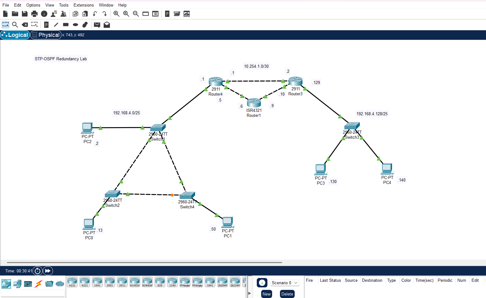

# NOC Incident Triage & Network Design Lab

Hands-on network engineering labs built to simulate real Tier 1 NOC scenarios — VLAN segmentation, inter-VLAN routing, DHCP, ACL-based security, redundancy (STP), dynamic routing (OSPF), NAT, and proactive monitoring (Zabbix). Each lab includes deliberately injected faults, diagnosed and documented using real incident ticket format.

Built in Cisco Packet Tracer.

## Why This Repo Exists

Networking theory is easy to claim on a resume — this repo is the proof. Every fault below was actually broken, actually diagnosed using CLI tools and packet-level traffic analysis, and actually fixed, with the full diagnostic trail documented the way a real NOC ticket would be written.

## Skills Demonstrated

- VLAN design and segmentation
- Inter-VLAN routing (SVI on a Layer 3 switch)
- DHCP configuration (per-VLAN scoping, exclusions)
- ACL-based traffic filtering (extended ACLs, wildcard masking)
- Trunk configuration and troubleshooting (802.1Q)
- Packet-level traffic analysis (Packet Tracer Simulation Mode)
- Incident documentation and root cause analysis (RCA)

---

## Lab 1: Small Office Network — VLANs, Inter-VLAN Routing, DHCP, ACL Security

### Scenario
A small office with 3 departments — Sales, IT, and Finance — each requiring its own VLAN and subnet, automatic IP addressing, and traffic isolation between Sales and Finance (with IT able to reach both).

### Topology
- 1 Layer 3 (multilayer) switch — SVI-based inter-VLAN routing
- 1 Layer 2 access switch
- 3 VLANs, each on a /26 subnet carved out of 12.4.2.0/24:

| VLAN | Department | Subnet | Usable Range | Gateway (SVI) |
|---|---|---|---|---|
| 10 | Sales | 12.4.2.0/26 | .1 – .62 | 12.4.2.62 |
| 20 | IT | 12.4.2.64/26 | .65 – .126 | 12.4.2.126 |
| 30 | Finance | 12.4.2.128/26 | .129 – .190 | 12.4.2.190 |


### Design Decisions
**SVI over router-on-a-stick:** chosen because a Layer 3 switch was available. SVI routes in hardware, avoids funneling all inter-VLAN traffic through a single physical link, and is simpler to manage than sub-interface encapsulation.

**Gateway addressing:** each VLAN's gateway uses a non-default address within its /26 block rather than the more conventional first address (e.g. 12.4.2.1). Not a deliberate design pattern — just how the lab was built — but worth noting that `.1` is the standard convention I'd default to in a production environment.

### Configuration Verification
| Evidence | Screenshot |
|---|---|
| All 3 SVIs up/up with correct IPs | `show ip int br` → [svi-status.png](screenshots/svi-status.png) |
| Trunk carrying all 3 VLANs | `show int trunk` → [trunk-allowed-vlans.png](screenshots/trunk-allowed-vlans.png) |
| Access ports correctly mapped to VLANs | `show vlan br` → [vlan-port-assignment.png](screenshots/vlan-port-assignment.png) |
| DHCP assigning correct subnet/gateway per VLAN | `ipconfig` on PC0 → [dhcp-verification.png](screenshots/dhcp-verification.png) |
| ACL actively blocking Sales↔Finance | ping test + `show access-lists` → [ping-tests.png](screenshots/ping-tests.png), [acl-config.png](screenshots/acl-config.png) |

### Configuration Summary
- Trunk link configured between access switch and multilayer switch, allowing VLANs 10, 20, 30
- SVIs configured per VLAN with `ip routing` enabled globally
- DHCP: one pool per VLAN on the L3 switch, gateway IPs excluded from each pool
- Extended ACL `block-sales-finance` applied outbound on the Sales and Finance VLAN interfaces, blocking Sales↔Finance while permitting all other traffic (including IT↔both)

### Faults Found & Fixed

#### Incident INC-001: Trunk Misconfiguration Isolating Sales VLAN
| Field | Detail |
|---|---|
| Severity | Sev2 — degraded, single VLAN isolated |
| Symptoms | Sales VLAN unable to reach gateway (12.4.2.62) or any other VLAN |
| Diagnostic Steps | `show ip interface brief` confirmed SVI up/up → `show interfaces trunk` revealed VLAN 10 missing from allowed list on multilayer switch trunk port |
| Root Cause | Trunk configured with `switchport trunk allowed vlan 20,30` — VLAN 10 omitted |
| Resolution | Corrected to `switchport trunk allowed vlan 10,20,30` on both ends of the trunk; verified via ping |
| Prevention | Standardize a trunk provisioning checklist listing all active VLANs explicitly at setup time |

Full ticket: [tickets/INC-001.md](tickets/INC-001.md)

#### Incident INC-002: ACL Wildcard Mask Error Allowing Blocked Traffic
| Field | Detail |
|---|---|
| Severity | Sev2 — security/compliance exposure, Sales and Finance VLANs able to communicate despite ACL segmentation policy |
| Symptoms | Ping tests between Sales (12.4.2.0/26) and Finance (12.4.2.128/26) unexpectedly succeeded |
| Diagnostic Steps | `show access-lists` showed match counts hitting `permit any any` instead of the deny lines → reviewed wildcard mask, found `0.0.0.64` instead of the correct `0.0.0.63` for a /26 subnet |
| Root Cause | Incorrect wildcard mask only covered 2 addresses instead of the full 64-address /26 range, allowing most traffic to fall through to the permit line |
| Resolution | Rebuilt ACL with corrected wildcard mask (`0.0.0.63`); verified fix via `show access-lists`, now showing 8 and 4 matches on the two deny lines respectively, with only 3 unrelated matches on permit |
| Prevention | Use the standard wildcard calculation (255 − subnet mask octet) for any non-/24 subnet; verify ACL match counters after initial deployment, not just config syntax |

Full ticket: [tickets/INC-002.md](tickets/INC-002.md)

### Verification Checklist
- [x] Each PC receives correct IP via DHCP for its VLAN
- [x] PCs within same VLAN can ping each other
- [x] IT can ping Sales and Finance
- [x] Sales cannot ping Finance (and vice versa) — confirmed via `Destination host unreachable` from ACL enforcement
- [x] Both faults diagnosed, fixed, and verified with match-count evidence

---

## Lab 2: Redundant Network — STP, OSPF, Loop Prevention & Link Failover

### Scenario
The office network expanded to a 3-switch redundant triangle at Site A, connected to Site B via a fully-meshed 3-router OSPF backbone. Goal: prove STP prevents a Layer 2 loop on redundant links, and that both STP and OSPF actually reroute traffic when a link fails — not just that they're configured.

### Topology
- 3 switches (Switch1, Switch2, Switch4) cabled in a physical triangle at Site A — 192.168.4.0/25
- 3 routers fully meshed (Router4, Router1, Router3) — each pair directly connected, giving OSPF two paths between any two routers
- 1 switch (Switch3) and 2 PCs at Site B — 192.168.4.128/25

| Link | Subnet |
|---|---|
| Router4 ↔ Router3 | 10.254.1.0/30 |
| Router4 ↔ Router1 | 10.254.1.4/30 |
| Router1 ↔ Router3 | 10.254.1.8/30 |



### Design Decisions
**Full router mesh over a single WAN link:** not strictly required by the base lab, but built this way so OSPF has a real backup path to reroute over, not just a second interface.

### Configuration Verification
| Evidence | Screenshot |
|---|---|
| STP elects Switch2 as root at default priority (lowest MAC) | `show spanning-tree` → [stp-default-root.png](screenshots/stp-default-root.png) |
| Manual root election via priority 4096 on Switch1 shifts root and blocked port | `show spanning-tree` → [stp-priority-change.png](screenshots/stp-priority-change.png) |
| OSPF full adjacency on all 3 routers, incl. ECMP across the triangle | `show ip ospf neighbor` / `show ip route` → [ospf-neighbors.png](screenshots/ospf-neighbors.png) |

### Configuration Summary
- 3 switches cabled in a deliberate Layer 2 loop; default IEEE STP left enabled — the loop is intentional, STP is what makes it safe
- Root bridge manually influenced via `spanning-tree vlan 1 priority 4096` on Switch1
- OSPF process 100 running on all 3 routers; all WAN links and both site LANs advertised
- Both site subnets reachable end-to-end via OSPF, with equal-cost paths across the router mesh

### Faults Found & Fixed
*Note: these two faults were injected deliberately to validate failover, not planted for someone else to find.*

#### Incident INC-003: Switch Link Failure — STP Reconvergence
| Field | Detail |
|---|---|
| Severity | Sev3 — planned failover test, redundant path available |
| Symptoms | None expected for end hosts; Switch4's root port (Fa0/1, direct link to Switch1) shut down deliberately |
| Diagnostic Steps | Baseline `show spanning-tree` confirmed Switch4's root port as Fa0/1, cost 19. After shutdown, root cost jumped to 38 and the previously-blocked Fa0/2 moved to Root LSN — STP re-selecting it as the new root port |
| Root Cause | N/A — deliberate fault injection |
| Resolution | Link restored (no shutdown) ~135 sec later; Fa0/1 reclaimed root port and Fa0/2 had already reverted to Altn BLK. Full "Fa0/2 = Forwarding" state wasn't directly captured, but the 135 sec gap exceeds the default ~30 sec convergence window (2×15 sec Forward Delay), so it's inferred rather than confirmed |
| Prevention | Default STP convergence (~30 sec) is slow for production — recommend Rapid PVST+ (802.1w) for sub-second failover. Also: capture `show spanning-tree` right before restoring a failed link, not just after breaking it |

Full ticket: [tickets/INC-003.md](tickets/INC-003.md)

#### Incident INC-004: Router Link Failure — OSPF Reroute
| Field | Detail |
|---|---|
| Severity | Sev3 — planned failover test, backup path available (full mesh) |
| Symptoms | None expected for end-to-end reachability; Router3's direct link to Router4 (10.254.1.0/30) shut down deliberately |
| Diagnostic Steps | `%OSPF-5-ADJCHG ... FULL to DOWN` logged immediately on both routers. `show ip ospf neighbor` confirmed only the Router1 adjacency remained on each side. `show ip route` showed the direct-cost-2 path replaced by a cost-3 path via Router1 |
| Root Cause | N/A — deliberate fault injection |
| Resolution | No manual action needed — OSPF automatically recalculated and installed the surviving path via Router1, with no loss of reachability between sites |
| Time to Recover | Under 35 sec — fault logged at elapsed ~25:08:30; by ~25:09:05 Router4 already showed a live FULL/BDR adjacency with an active dead-timer over the backup path |
| Prevention | The full 3-router mesh is what made this a non-event — a single-homed WAN design would have made Site B fully unreachable instead |

Full ticket: [tickets/INC-004.md](tickets/INC-004.md)

### Verification Checklist
- [x] Only one path active between switches at a time (confirmed via `show spanning-tree`)
- [x] Manual root election confirmed: priority change on Switch1 moved both root bridge and blocked port
- [x] STP reconverges after a link failure — Listening-state transition observed directly; full Forwarding inferred from timing, not directly captured (see INC-003)
- [x] OSPF neighbors form FULL adjacency across all 3 routers, including ECMP paths
- [x] OSPF reroutes automatically in under 35 sec after a router link failure, no loss of reachability
- [x] Both faults documented with before/after CLI evidence

### Scenario
To eliminate single points of failure, the office network expanded to a 3-switch redundant core/access triangle connected to a secondary site via a dual-router OSPF WAN backbone. The goal is to enforce loop-free Layer 2 topology while enabling dynamic Layer 3 routing and verifying sub-second to low-second failover behavior.


## Lab 4: Full Incident Response Simulation *(planned)*

---

## Tools Used
- Cisco Packet Tracer
- Zabbix *(Lab 4)*

## Repo Structure
```
/screenshots
  topology.png
  svi-status.png
  trunk-allowed-vlans.png
  vlan-port-assignment.png
  dhcp-verification.png
  ping-tests.png
  acl-config.png
  stp-default-root.png
  stp-priority-change.png
  ospf-neighbors.png
  inc003-fault-and-recovery.png
/tickets
  INC-001.md
  INC-002.md
  INC-003.md
  INC-004.md
README.md
```
